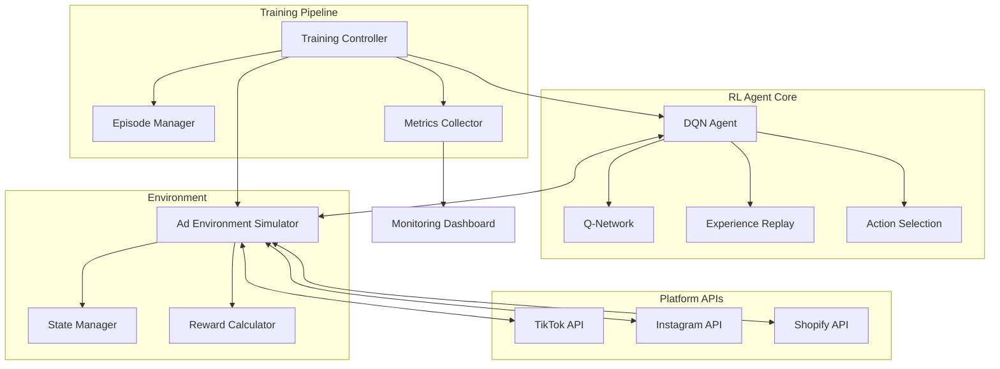

# 🎯 RL-Powered T-Shirt Ad Campaign Optimizer

[](https://www.typescriptlang.org/)
[](LICENSE)
[](https://nodejs.org/)
[]()
[]()

> **An intelligent reinforcement learning system that automates and optimizes advertising campaigns for e-commerce t-shirt businesses across multiple platforms, maximizing profitability through continuous learning.**

Note: The code has been modularized into separate files for clarity and maintainability. See the Project Structure section below for details and updated commands.

## 📋 Table of Contents

- [Overview](#-overview)
- [Key Features](#-key-features)
- [Architecture](#-architecture)
- [Quick Start](#-quick-start)
- [Installation](#-installation)
- [Usage](#-usage)
- [Configuration](#-configuration)
- [API Reference](#-api-reference)
- [How It Works](#-how-it-works)
- [Performance Metrics](#-performance-metrics)
- [Examples](#-examples)
- [Testing](#-testing)
- [Deployment](#-deployment)
- [Troubleshooting](#-troubleshooting)
- [Roadmap](#-roadmap)
- [Contributing](#-contributing)
- [License](#-license)
- [Acknowledgments](#-acknowledgments)

## 🧱 Project Structure (Modularized)

This repo uses a modular TypeScript structure:

```
src/
  agent/
    base.ts            # RLAgent abstract base
    dqnAgent.ts        # DQNAgent implementation
  environment/
    simulator.ts       # Ad environment simulator
  observers/
    types.ts           # TrainingObserver interface
    consoleLogger.ts   # Console logger observer
    metricsCollector.ts# Metrics collector observer
  platforms/
    base.ts            # AdPlatformAPI abstract base
    factory.ts         # Platform factory
    mockTikTok.ts      # TikTok mock API
    mockInstagram.ts   # Instagram mock API
  types.ts             # Shared types (state/actions/metrics)
  index.ts             # Barrel exports
  main.ts              # CLI/entry point (training demo)
```

Build and run commands:

- Start (dev): `npm start` (ts-node `src/main.ts`)
- Build: `npm run build` (outputs to `dist/`)
- Start (prod): `npm run start:prod` (builds then runs `node dist/main.js`)

## 🌟 Overview

This project implements a **Deep Q-Learning (DQN)** agent that learns to optimize advertising campaigns for t-shirt businesses across TikTok and Instagram. By continuously learning from campaign performance data, the system automatically adjusts budgets, targeting parameters, creative strategies, and platform allocation to maximize profit.

### 🎬 Demo

```
Episode 1 | Total Reward: -2.34 | Profit: -$234
Episode 50 | Total Reward: 8.92 | Profit: $892
         ↑ 380% improvement through learning!
```

## 📚 Documentation

- API Integration Spec: `docs/api_spec.md`
- Production Integration Guide: `docs/real_integration.md`
- Low-Spend Rollout Guide: `docs/low_spend_rollout.md`
- PoC Launch Checklist: `docs/poc_checklist.md`
 - Mathematical Primer: `docs/math_primer.md`

### 🚀 Why Reinforcement Learning for Ad Optimization?

Traditional rule-based ad optimization fails to capture complex, non-linear relationships between:

- **Temporal patterns** (day/hour performance variations)
- **Platform dynamics** (TikTok vs Instagram audiences)
- **Creative fatigue** (performance decay over time)
- **Competitive landscapes** (bidding wars, market saturation)

RL agents discover optimal strategies through exploration and exploitation, continuously adapting to market changes.

## ✨ Key Features

### 🤖 Intelligent Automation

- **Self-learning optimization** without manual rules
- **Multi-platform orchestration** across TikTok, Instagram, and Shopify
- **24/7 autonomous operation** with safety guardrails

### 📊 Advanced Capabilities

- **Deep Q-Network (DQN)** with experience replay
- **Real-time adaptation** to market conditions
- **A/B testing integration** for policy validation
- **Multi-objective optimization** (profit, ROAS, CPA)

### 🏗️ Enterprise Architecture

- **SOLID principles** and Gang of Four patterns
- **Modular design** for easy platform additions
- **Observable training** with metrics collection
- **Production-ready** logging and monitoring

### 🔧 Developer Experience

- **TypeScript** for type safety
- **Mock APIs** for development/testing
- **Comprehensive testing** suite
- **Detailed documentation** and examples

## 🏛️ Architecture

### System Overview



### Component Architecture

```
src/
├── core/
│   ├── interfaces/           # TypeScript interfaces
│   │   ├── IAdEnvironment.ts
│   │   ├── IAgent.ts
│   │   └── IPlatformAPI.ts
│   ├── agents/               # RL Agent implementations
│   │   ├── DQNAgent.ts      # Deep Q-Learning
│   │   ├── PPOAgent.ts      # Proximal Policy Optimization
│   │   └── A2CAgent.ts      # Advantage Actor-Critic
│   └── environment/          # Environment logic
│       ├── AdEnvironment.ts
│       ├── StateManager.ts
│       └── RewardCalculator.ts
├── platforms/                # Platform integrations
│   ├── tiktok/
│   │   ├── TikTokAPI.ts
│   │   └── TikTokSimulator.ts
│   ├── instagram/
│   │   ├── InstagramAPI.ts
│   │   └── InstagramSimulator.ts
│   └── factory/
│       └── PlatformFactory.ts
├── training/                 # Training pipeline
│   ├── TrainingPipeline.ts
│   ├── observers/
│   │   ├── ConsoleLogger.ts
│   │   ├── MetricsCollector.ts
│   │   └── TensorBoard.ts
│   └── replay/
│       └── ExperienceReplay.ts
├── utils/                    # Utilities
│   ├── config/
│   │   └── Configuration.ts
│   ├── logging/
│   │   └── Logger.ts
│   └── metrics/
│       └── MetricsCalculator.ts
└── main.ts                   # Entry point
```

### Design Patterns

| Pattern             | Implementation         | Purpose                         |
| ------------------- | ---------------------- | ------------------------------- |
| **Strategy**        | `RLAgent` base class   | Swap RL algorithms (DQN→PPO)    |
| **Factory**         | `PlatformFactory`      | Create platform-specific APIs   |
| **Observer**        | `TrainingObserver`     | Monitor training progress       |
| **Adapter**         | `EnvironmentSimulator` | Unified platform interface      |
| **Command**         | `TrainingPipeline`     | Encapsulate training operations |
| **Singleton**       | `Configuration`        | Global settings management      |
| **Template Method** | `BaseAgent.train()`    | Standardize training loop       |

## 🚀 Quick Start

```bash
# Clone the repository
git clone https://github.com/yourusername/rl-tshirt-ads.git
cd rl-tshirt-ads

# Install dependencies
npm install

# Run with default configuration
npm start

# Watch training progress
tail -f logs/training.log
```

## 📦 Installation

### Prerequisites

- **Node.js** 18.0+ ([Download](https://nodejs.org/))
- **TypeScript** 4.9+ (`npm install -g typescript`)
- **Git** 2.0+

### Step-by-Step Installation

1. **Clone the repository**

   ```bash
   git clone https://github.com/yourusername/rl-tshirt-ads.git
   cd rl-tshirt-ads
   ```

2. **Install dependencies**

   ```bash
   npm install
   ```

3. **Configure environment**

   ```bash
   cp .env.example .env
   # Edit .env with your settings
   ```

4. **Build the project**

   ```bash
   npm run build
   ```

5. **Run tests**

   ```bash
   npm test
   ```

6. **Start training**
   ```bash
   npm run train
   ```

### Docker Installation

```dockerfile
# Dockerfile
FROM node:18-alpine
WORKDIR /app
COPY package*.json ./
RUN npm ci --only=production
COPY . .
RUN npm run build
CMD ["npm", "start"]
```

```bash
# Build and run with Docker
docker build -t rl-tshirt-ads .
docker run -it --rm rl-tshirt-ads
```

## 💻 Usage

### Basic Training

```typescript
import { DQNAgent, AdEnvironmentSimulator, TrainingPipeline } from "./src";

// Initialize components
const agent = new DQNAgent({
  learningRate: 0.001,
  discountFactor: 0.95,
  epsilon: 1.0,
  epsilonDecay: 0.995,
});

const environment = new AdEnvironmentSimulator({
  platforms: ["tiktok", "instagram"],
  initialBudget: 500,
  episodeLength: 24, // hours
});

const pipeline = new TrainingPipeline(agent, environment);

// Train the agent
await pipeline.train({
  episodes: 1000,
  saveInterval: 100,
  logInterval: 10,
});
```

### Advanced Configuration

```typescript
// Custom reward shaping
const customRewardCalculator = new RewardCalculator({
  profitWeight: 0.7,
  roasWeight: 0.2,
  conversionWeight: 0.1,
  penalizeBudgetOverspend: true,
});

// Multi-objective optimization
const agent = new DQNAgent({
  rewardCalculator: customRewardCalculator,
  actionSpace: {
    budgetRange: [0.5, 2.0],
    platforms: ["tiktok", "instagram", "facebook"],
    creativeTypes: ["lifestyle", "product", "ugc", "discount"],
    ageGroups: ["18-24", "25-34", "35-44", "45+"],
  },
});

// Add custom observers
pipeline.addObserver(new TensorBoardLogger());
pipeline.addObserver(
  new SlackNotifier({
    webhookUrl: process.env.SLACK_WEBHOOK,
    notifyOn: ["episode_complete", "milestone_reached"],
  })
);
```

### Production Deployment

```typescript
// Load pre-trained model
const agent = new DQNAgent();
await agent.load("./models/production_model.json");

// Set to exploitation mode (no exploration)
agent.setEpsilon(0);

// Run in production with safety constraints
const productionEnv = new AdEnvironmentSimulator({
  mode: "production",
  constraints: {
    maxDailyBudget: 10000,
    minROAS: 1.5,
    maxBudgetChangePercent: 30,
  },
});

// Execute optimizations
const controller = new ProductionController(agent, productionEnv);
await controller.run({
  interval: "1h", // Run every hour
  dryRun: false, // Apply changes to real campaigns
  monitoring: true, // Enable performance monitoring
});
```

## ⚙️ Configuration

### Environment Variables (.env)

```env
# Training Configuration
EPISODES=1000
BATCH_SIZE=32
LEARNING_RATE=0.001
DISCOUNT_FACTOR=0.95
EPSILON_START=1.0
EPSILON_DECAY=0.995
EPSILON_MIN=0.01

# Platform Configuration
TIKTOK_API_KEY=mock_key_123
INSTAGRAM_API_KEY=mock_key_456
SHOPIFY_API_KEY=mock_key_789

# Monitoring
ENABLE_TENSORBOARD=true
TENSORBOARD_PORT=6006
LOG_LEVEL=info
METRICS_EXPORT_PATH=./metrics

# Safety Constraints
MAX_DAILY_BUDGET=10000
MIN_ROAS_THRESHOLD=1.0
MAX_BUDGET_CHANGE_PERCENT=50
```

### Configuration File (config.json)

```json
{
  "agent": {
    "type": "DQN",
    "network": {
      "hidden_layers": [128, 64, 32],
      "activation": "relu",
      "optimizer": "adam"
    },
    "memory": {
      "capacity": 10000,
      "batch_size": 32
    }
  },
  "environment": {
    "state_space": {
      "dimensions": 15,
      "normalization": true
    },
    "action_space": {
      "type": "discrete",
      "size": 120
    },
    "reward": {
      "type": "profit",
      "normalization_factor": 1000
    }
  },
  "training": {
    "episodes": 1000,
    "max_steps_per_episode": 24,
    "save_interval": 100,
    "evaluation_interval": 50
  }
}
```

## 📚 API Reference

### Core Classes

#### DQNAgent

```typescript
class DQNAgent extends RLAgent {
  constructor(config?: AgentConfig);

  // Core methods
  selectAction(state: AdEnvironmentState): AdAction;
  update(
    state: AdEnvironmentState,
    action: AdAction,
    reward: number,
    nextState: AdEnvironmentState
  ): void;

  // Model persistence
  save(filepath: string): Promise<void>;
  load(filepath: string): Promise<void>;

  // Configuration
  setEpsilon(value: number): void;
  setLearningRate(value: number): void;
}
```

#### AdEnvironmentSimulator

```typescript
class AdEnvironmentSimulator {
  constructor(config?: EnvironmentConfig);

  // Environment control
  reset(): AdEnvironmentState;
  step(action: AdAction): [AdEnvironmentState, number, boolean];

  // State management
  getCurrentState(): AdEnvironmentState;
  setState(state: AdEnvironmentState): void;

  // Platform management
  addPlatform(name: string, api: AdPlatformAPI): void;
  removePlatform(name: string): void;
}
```

#### TrainingPipeline

```typescript
class TrainingPipeline {
  constructor(agent: RLAgent, environment: AdEnvironmentSimulator);

  // Training control
  train(config: TrainingConfig): Promise<TrainingResults>;
  pause(): void;
  resume(): void;
  stop(): void;

  // Observation
  addObserver(observer: TrainingObserver): void;
  removeObserver(observer: TrainingObserver): void;

  // Metrics
  getMetrics(): TrainingMetrics;
  exportMetrics(filepath: string): Promise<void>;
}
```

### Interfaces

#### AdEnvironmentState

```typescript
interface AdEnvironmentState {
  // Temporal features
  dayOfWeek: number; // 0-6
  hourOfDay: number; // 0-23

  // Campaign parameters
  currentBudget: number;
  targetAgeGroup: string;
  targetInterests: string[];
  creativeType: string;
  platform: string;

  // Performance metrics
  historicalCTR: number;
  historicalCVR: number;

  // Market conditions
  competitorActivity: number; // 0-1
  seasonality: number; // 0-1
}
```

#### AdAction

```typescript
interface AdAction {
  budgetAdjustment: number; // Multiplier (0.5-2.0)
  targetAgeGroup: string;
  targetInterests: string[];
  creativeType: string;
  bidStrategy: "CPC" | "CPM" | "CPA";
  platform: "tiktok" | "instagram" | "shopify";
}
```

## 🧠 How It Works

### 1. State Observation

The agent observes the current state of all ad campaigns:

- **Temporal context**: Day of week, hour of day
- **Campaign settings**: Budget, targeting, creative
- **Performance history**: CTR, CVR, ROAS
- **Market dynamics**: Competition, seasonality

### 2. Action Selection

Using ε-greedy strategy:

- **Exploration** (ε): Try random actions to discover new strategies
- **Exploitation** (1-ε): Choose the best-known action for the current state

### 3. Environment Interaction

The environment simulates campaign performance:

```
Action → API Call → Performance Metrics → Reward Signal
```

### 4. Learning Update

Q-learning formula:

```
Q(s,a) ← Q(s,a) + α[r + γ max Q(s',a') - Q(s,a)]
```

Where:

- `Q(s,a)`: Expected value of action `a` in state `s`
- `α`: Learning rate
- `r`: Immediate reward
- `γ`: Discount factor
- `s'`: Next state

### 5. Experience Replay

Store experiences and learn from random batches:

- Breaks correlation between sequential experiences
- Improves sample efficiency
- Stabilizes learning

## 📊 Performance Metrics

### Training Metrics

| Metric                     | Description                        | Target |
| -------------------------- | ---------------------------------- | ------ |
| **Average Episode Reward** | Mean reward over last 100 episodes | > 5.0  |
| **Convergence Rate**       | Episodes to stable performance     | < 500  |
| **Exploration Efficiency** | Unique state-actions discovered    | > 80%  |
| **Learning Stability**     | Reward variance over time          | < 0.5  |

### Business Metrics

| Metric     | Formula                | Target   |
| ---------- | ---------------------- | -------- |
| **Profit** | Revenue - Ad Spend     | Maximize |
| **ROAS**   | Revenue / Ad Spend     | > 3.0    |
| **CPA**    | Ad Spend / Conversions | < $15    |
| **CTR**    | Clicks / Impressions   | > 2%     |
| **CVR**    | Conversions / Clicks   | > 3%     |

### Monitoring Dashboard

```
┌─────────────────────────────────────────┐
│          Training Progress              │
├─────────────────────────────────────────┤
│ Episode: 847/1000                       │
│ ████████████████████░░░░ 84.7%         │
│                                         │
│ Current Reward: 7.23                    │
│ Avg Reward (100 ep): 6.85              │
│ Best Reward: 9.42                       │
│                                         │
│ Epsilon: 0.03                           │
│ Learning Rate: 0.001                    │
│                                         │
│ Platform Distribution:                  │
│   TikTok: 62%                          │
│   Instagram: 38%                       │
│                                         │
│ Top Creative: UGC (34%)                │
│ Top Age Group: 18-24 (41%)             │
└─────────────────────────────────────────┘
```

## 📝 Examples

### Example 1: Basic Training Script

```typescript
// train.ts
import { createDefaultPipeline } from "./src/factory";

async function main() {
  // Create pipeline with defaults
  const pipeline = createDefaultPipeline();

  // Train for 100 episodes
  const results = await pipeline.train({ episodes: 100 });

  // Print results
  console.log("Training Complete!");
  console.log(`Final Avg Reward: ${results.avgReward}`);
  console.log(`Best Episode: ${results.bestEpisode}`);
  console.log(`Total Profit: $${results.totalProfit}`);
}

main().catch(console.error);
```

### Example 2: Custom Platform Integration

```typescript
// custom-platform.ts
import { AdPlatformAPI, AdPlatformFactory } from "./src/platforms";

class CustomPlatformAPI extends AdPlatformAPI {
  async updateCampaign(campaignId: string, params: any): Promise<any> {
    // Your custom API logic
    return { success: true };
  }

  simulatePerformance(
    state: AdEnvironmentState,
    action: AdAction
  ): RewardMetrics {
    // Custom performance simulation
    return {
      revenue: Math.random() * 1000,
      adSpend: action.budgetAdjustment * state.currentBudget,
      profit: 0,
      roas: 0,
      conversions: 0,
    };
  }
}

// Register the new platform
AdPlatformFactory.registerPlatform("custom", new CustomPlatformAPI());
```

### Example 3: Real-time Optimization

```typescript
// realtime.ts
import { ProductionController } from "./src/production";

const controller = new ProductionController({
  modelPath: "./models/trained_model.json",
  platforms: ["tiktok", "instagram"],
  updateInterval: "30m",
  dryRun: false,
});

// Start real-time optimization
controller.start();

// Monitor performance
controller.on("optimization", (result) => {
  console.log(`Optimization at ${new Date()}`);
  console.log(`Platform: ${result.platform}`);
  console.log(`Budget Change: ${result.budgetChange}%`);
  console.log(`Expected Profit: $${result.expectedProfit}`);
});
```

## 🧪 Testing

### Run All Tests

```bash
npm test
```

### Run Specific Test Suites

```bash
# Unit tests
npm run test:unit

# Integration tests
npm run test:integration

# E2E tests
npm run test:e2e

# Performance tests
npm run test:performance
```

### Test Coverage

```bash
npm run test:coverage
```

### Example Test

```typescript
// tests/agent.test.ts
import { DQNAgent } from "../src/agents/DQNAgent";

describe("DQNAgent", () => {
  let agent: DQNAgent;

  beforeEach(() => {
    agent = new DQNAgent({ epsilon: 0.5 });
  });

  test("should select random action during exploration", () => {
    const state = createMockState();
    const actions = new Set();

    // Collect 100 actions
    for (let i = 0; i < 100; i++) {
      const action = agent.selectAction(state);
      actions.add(JSON.stringify(action));
    }

    // Should have multiple different actions
    expect(actions.size).toBeGreaterThan(1);
  });

  test("should improve performance through learning", () => {
    const env = createMockEnvironment();
    const initialReward = evaluateAgent(agent, env);

    // Train for 100 episodes
    trainAgent(agent, env, 100);

    const finalReward = evaluateAgent(agent, env);
    expect(finalReward).toBeGreaterThan(initialReward);
  });
});
```

## 🚢 Deployment

### Development

```bash
npm run dev
```

### Staging

```bash
npm run deploy:staging
```

### Production

#### Using PM2

```bash
# Install PM2
npm install -g pm2

# Start application
pm2 start ecosystem.config.js --env production

# Monitor
pm2 monit

# Logs
pm2 logs
```

#### Using Kubernetes

```yaml
# k8s/deployment.yaml
apiVersion: apps/v1
kind: Deployment
metadata:
  name: rl-tshirt-ads
spec:
  replicas: 3
  selector:
    matchLabels:
      app: rl-tshirt-ads
  template:
    metadata:
      labels:
        app: rl-tshirt-ads
    spec:
      containers:
        - name: app
          image: your-registry/rl-tshirt-ads:latest
          ports:
            - containerPort: 3000
          env:
            - name: NODE_ENV
              value: "production"
          resources:
            requests:
              memory: "512Mi"
              cpu: "500m"
            limits:
              memory: "1Gi"
              cpu: "1000m"
```

## 🔧 Troubleshooting

### Common Issues

#### Issue: Training not converging

**Solution**:

- Decrease learning rate: `agent.setLearningRate(0.0001)`
- Increase exploration: `agent.setEpsilon(1.0)`
- Check reward normalization

#### Issue: Out of memory during training

**Solution**:

- Reduce replay buffer size
- Decrease batch size
- Enable memory profiling: `NODE_OPTIONS="--max-old-space-size=4096"`

#### Issue: Poor performance on specific platform

**Solution**:

- Platform-specific reward shaping
- Increase training episodes for that platform
- Check platform API simulator accuracy

### Debug Mode

```bash
# Enable verbose logging
DEBUG=* npm start

# Profile memory usage
npm run profile:memory

# Analyze performance
npm run profile:cpu
```

## 🗺️ Roadmap

### Phase 1: Foundation (Current)

- ✅ Basic DQN implementation
- ✅ Mock platform APIs
- ✅ Training pipeline
- ✅ Metrics collection

### Phase 2: Advanced RL (Q1 2025)

- ⬜ Proximal Policy Optimization (PPO)
- ⬜ Multi-agent competition
- ⬜ Continuous action spaces
- ⬜ Hierarchical RL for campaign strategies

### Phase 3: Production Features (Q2 2025)

- ⬜ Real API integrations
- ⬜ A/B testing framework
- ⬜ AutoML for hyperparameter tuning
- ⬜ Real-time streaming data pipeline

### Phase 4: Scale & Intelligence (Q3 2025)

- ⬜ Distributed training (Ray/RLlib)
- ⬜ Transfer learning between businesses
- ⬜ Natural language strategy descriptions
- ⬜ Automated creative generation

### Phase 5: Platform Expansion (Q4 2025)

- ⬜ Google Ads integration
- ⬜ Amazon Advertising
- ⬜ LinkedIn Ads
- ⬜ Cross-platform budget optimization

## 🤝 Contributing

We welcome contributions! Please see our [Contributing Guide](CONTRIBUTING.md) for details.

### Development Setup

1. Fork the repository
2. Create your feature branch (`git checkout -b feature/AmazingFeature`)
3. Commit your changes (`git commit -m 'Add some AmazingFeature'`)
4. Push to the branch (`git push origin feature/AmazingFeature`)
5. Open a Pull Request

### Code Style

- Follow TypeScript best practices
- Use ESLint and Prettier
- Write tests for new features
- Update documentation

### Commit Convention

```
type(scope): description

[optional body]

[optional footer]
```

Types: `feat`, `fix`, `docs`, `style`, `refactor`, `test`, `chore`

## 📄 License

This project is licensed under the MIT License - see the [LICENSE](LICENSE) file for details.

```
MIT License

Copyright (c) 2024 Your Company

Permission is hereby granted, free of charge, to any person obtaining a copy
of this software and associated documentation files (the "Software"), to deal
in the Software without restriction, including without limitation the rights
to use, copy, modify, merge, publish, distribute, sublicense, and/or sell
copies of the Software, and to permit persons to whom the Software is
furnished to do so, subject to the following conditions:

# 🎯 RL-Powered T-Shirt Ad Campaign Optimizer
[Full license text...]
```

## 🙏 Acknowledgments

- **OpenAI Gym** - Inspiration for environment design
- **Stable Baselines3** - Reference implementations
- **TensorFlow.js** - Neural network capabilities
- **The RL Community** - Continuous learning and support

## 📞 Support

- **Documentation**: [https://docs.example.com](https://docs.example.com)
- **Issues**: [GitHub Issues](https://github.com/yourusername/rl-tshirt-ads/issues)
- **Discussions**: [GitHub Discussions](https://github.com/yourusername/rl-tshirt-ads/discussions)
- **Email**: support@example.com
- **Discord**: [Join our server](https://discord.gg/example)

## 📈 Status


---

<div align="center">
  <b>Built with ❤️ by the AI Optimization Team</b>
  <br>
  <i>Maximizing profits through intelligent automation</i>
</div>

## Project Updates (Modularization + Real Runner)

- Modularized codebase with separate modules for agent, environment, platforms, observers, training, and a barrel export in `src/index.ts`.
- Added simulator improvements (realistic spend/revenue logic, reward shaping, peak-hour boosts).
- Added real runner skeleton: `npm run run:real` with flags for `--mode`, `--daily-budget-target`, `--peak-hours`, `--delta-max`, `--lambda-spend`, `--lagrange-step`, `--canary-list`.
- Cost-sensitive objective (λ-spend) to minimize spend while maximizing profit.
- Safety guardrails starter (`src/execution/guardrails.ts`), to enforce daily cap, delta clamp, peak hours, and freeze conditions.
- Documentation added:
  - `docs/api_spec.md`
  - `docs/real_integration.md`
  - `docs/low_spend_rollout.md`
  - `docs/poc_checklist.md`
